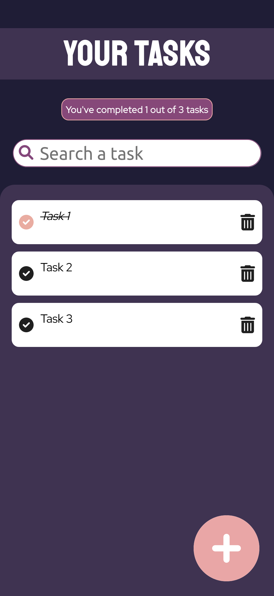
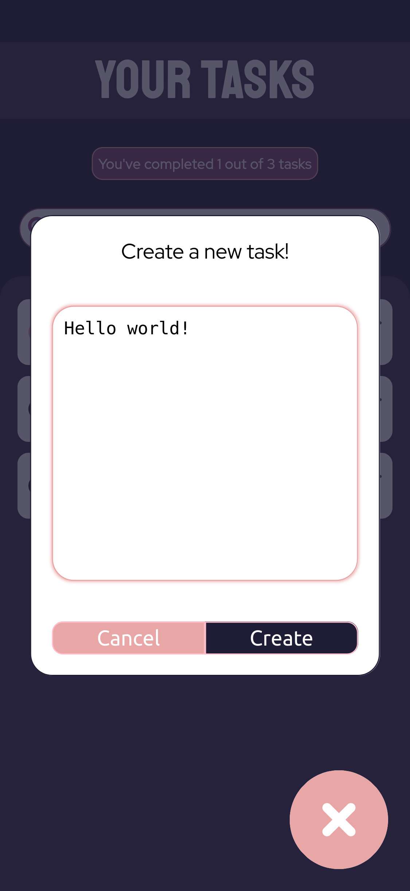

# Tasks Organizer App

Tasks Organizer App created using ReactJS to study purpouses as Platzi React Courses

## Overview

- [Used Tools](#used-tools)
    - [Future Ideas](#future-ideas)
- [Screenshots](#screenshots)
- [Links](#links)
- [Author](#author)

## Used Tools

Project design using:
- ReactJS
- FontAwesome icons
- CSS
- MobileFirst concept
- Figma

### Future Ideas

This app is projected to have a desktop user interface. Right now mobile view is the only screen resolution available.

## Screenshots

### Main view

### Modal view

### Links

- Figma design: [link](https://www.figma.com/proto/gbJUgP7toNcgR73P92rnqv/ToDo-App-with-React?node-id=11%3A42&scaling=scale-down&page-id=0%3A1&starting-point-node-id=11%3A42&show-proto-sidebar=1)
- GitHub pages: [link](https://mperezs06408.github.io/task-organizer)

## Author

Created by Santiago Pérez
- Front-end Developer
- **GitHub**: [@mperezs06408](https://github.com/mperezs06408)
- **LinkedIn**: [m.santiagoperez.s](https://www.linkedin.com/in/msantiagoperezs/)